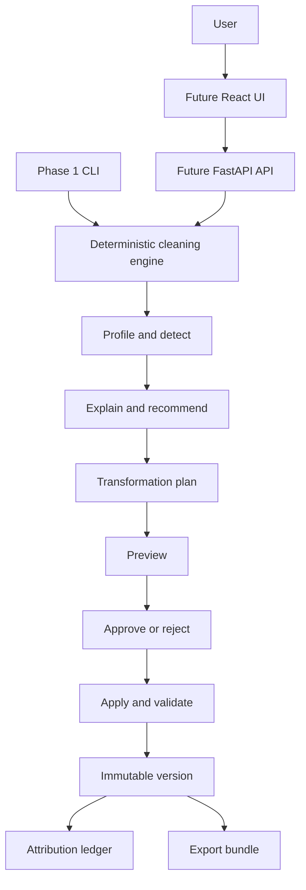

# ClearSet

ClearSet is a local-first evidence trail for dataset changes, with cleaning assistance. It makes every change reviewable, attributable, reproducible, and portable. Its product thesis is narrower than "AI cleans your CSV": ClearSet records what changed, why it changed, and who or what approved it.

The local core is a validation and adoption path. The long-term paid product hypothesis is hosted, team-based evidence for compliance, risk, and data-audit teams that need to review or certify changes made by humans, rules, or AI agents.

## Core workflow

```text
Inspect -> Profile -> Detect -> Recommend -> Preview -> Validate
-> Approve -> Apply -> Validate again -> Version -> Audit -> Export
```

ClearSet must never silently overwrite an original dataset. The original input remains available, and every approved transformation creates a new dataset version.

## Main capabilities

- Automatic dataset profiling
- Missing-value, duplicate, type, validity, consistency, and outlier checks
- Explainable cleaning recommendations
- Safe before-and-after previews
- User approval before transformations are applied
- Reversible transformations and immutable dataset versions
- Audit history and data lineage
- CSV support in the first experiment; Parquet is added only after the workflow works on one real dataset
- Tool-agnostic ingestion: ClearSet should be able to audit an output and supplied recipe from another tool
- Rejected suggestions are recorded with the reviewer and reason
- Signed portable export bundles can be independently verified
- One evidence record can produce reviewer and executive explanations
- Database and object-storage connectors later
- Exportable JSON cleaning recipes, Python code, SQL where possible, and quality reports
- Optional machine-learning checks for label errors, leakage, imbalance, and duplicates
- Simple web interface for non-programmers

## Initial scope

The first usable experiment should support one real CSV, local execution, profiling, duplicate and missing-value detection, recommendations, preview, validation, versioning, attribution history, and export. Parquet and additional formats are follow-up decisions.

Recommended stack after the script is validated:

- Python and FastAPI for the backend API
- Polars for dataframe processing
- DuckDB for local analytical queries and larger files
- Pandera for schemas and validation
- SQLite for local metadata and audit records
- Local file storage for original and versioned datasets
- React with TypeScript for the web interface when the UI is introduced

## Architecture summary

The first implementation is a plain Python script with no framework. Once the deterministic workflow is proven, a FastAPI modular monolith can expose the same engine. Workers, queues, permissions, and hosted storage are later responses to measured demand, not part of Phase 0.

### Architecture at a glance

```text
User
  -> Local script / future CLI
       -> Profile and detect
       -> Explain and recommend
       -> Preview and approve/reject
       -> Apply and validate
       -> Immutable version
       -> Attribution ledger and export bundle
```

The Mermaid version below provides the visual architecture when Markdown preview is enabled.



## Documentation

### Diagrams

- [Architecture diagram](docs/ARCHITECTURE.md#visible-architecture-flow): components, data plane, control plane, storage, and workers
- [Processing workflow diagram](docs/WORKFLOW.md#visible-workflow): upload, profile, recommend, preview, validate, version, and export

### Documentation files

- [Product brief](docs/PRODUCT_BRIEF.md): purpose, users, value, and scope
- [Architecture](docs/ARCHITECTURE.md): components, boundaries, storage, and scaling design
- [Workflow](docs/WORKFLOW.md): detailed upload-to-export behavior
- [Data model](docs/DATA_MODEL.md): datasets, versions, issues, jobs, and transformations
- [Quality and ML checks](docs/QUALITY_CHECKS.md): profiling, validation, and machine-learning checks
- [Roadmap](docs/ROADMAP.md): phased implementation plan
- [Differentiation](docs/DIFFERENTIATION.md): comparison with open-source projects
- [Scaling](docs/SCALING.md): path from local application to a multi-worker service
- [Decisions](docs/DECISIONS.md): agreed answers to important product and technical questions
- [Requirements and answers](docs/OPEN_QUESTIONS.md): answered planning questions and assumptions to validate
- [Requirements traceability](docs/REQUIREMENTS.md): coverage of the discussed capabilities

## Project principles

1. Preserve the original dataset.
2. Explain recommendations before applying them.
3. Require approval for destructive or high-risk changes.
4. Make transformations reproducible.
5. Validate both previews and final outputs.
6. Keep connectors, profiling, detection, and transformations independent.
7. Start local and simple, but keep interfaces ready for scale.

## First-release boundary

Phase 0 is a plain Python script run against one real CSV. Phase 1 becomes a deterministic CLI covering profile, detect, recommend, preview, apply, validate, version, attribution, and export. Parquet, FastAPI, React, ML checks, hosted workspaces, and background workers follow only after this path works end to end.

## Validation gate

Before building a UI or hosted product, run the script on one real dataset and show it to one real person who might pay. The result is a product decision, not a documentation exercise: continue, change the wedge, or stop.

Do not move to hosted collaboration until the local artifact shows that a defined customer uses the evidence to make a faster or more defensible change decision, and identifies a recurring shared-workflow need.

## Intended repository

The planned public repository is [SujAnverse1125/ClearSet](https://github.com/SujAnverse1125/ClearSet).
