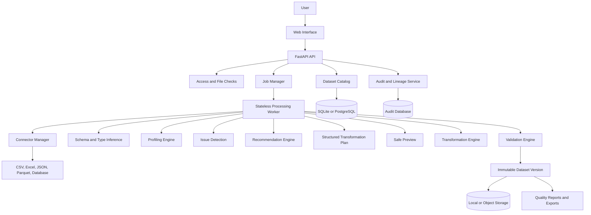

# ClearSet

ClearSet is a local-first, explainable dataset-quality and cleaning Buuddy. It helps users understand what is wrong with a dataset, choose safe corrections, preview the result, validate the output, and preserve every approved change as a reversible version.

The project is intended for personal projects first, with an architecture that can later support teams, databases, cloud storage, large datasets, and machine-learning workflows.

## Core workflow

```text
Inspect -> Profile -> Detect -> Recommend -> Preview -> Validate
-> Approve -> Apply -> Validate again -> Version -> Audit -> Export
```

ClearSet must never silently overwrite an original dataset. The original input remains available, and every approved transformation creates a new dataset version.

## Main capabilities

- Automatic dataset profiling
- Missing-value, duplicate, type, validity, consistency, and outlier checks
- Explainable cleaning recommendations
- Safe before-and-after previews
- User approval before transformations are applied
- Reversible transformations and immutable dataset versions
- Audit history and data lineage
- CSV and Parquet support in the first release; Excel and JSON are planned next
- Database and object-storage connectors later
- Exportable JSON cleaning recipes, Python code, SQL where possible, and quality reports
- Optional machine-learning checks for label errors, leakage, imbalance, and duplicates
- Simple web interface for non-programmers

## Initial scope

The first usable release should support CSV and Parquet files, local execution, profiling, duplicate and missing-value detection, recommendations, preview, validation, versioning, audit history, and export.

Recommended initial stack:

- Python and FastAPI for the backend API
- Polars for dataframe processing
- DuckDB for local analytical queries and larger files
- Pandera for schemas and validation
- SQLite for local metadata and audit records
- Local file storage for original and versioned datasets
- React with TypeScript for the web interface when the UI is introduced

## Architecture summary

The API is the control plane. It manages datasets, users, jobs, metadata, permissions, and audit events. Workers are the data plane. They profile and transform datasets without making the API wait for large operations.

### Architecture at a glance

```text
User
  -> Web Interface
  -> FastAPI API
       -> Access and file checks
       -> Dataset catalog and audit history
       -> Job manager
            -> Processing worker
                 -> Connector manager
                 -> Schema and profiling
                 -> Issue detection
                 -> Recommendations
                 -> Safe preview
                 -> Approved transformations
                 -> Output validation
                 -> Immutable dataset version
                      -> Local or object storage
                      -> Reports and exports
```

The Mermaid version below provides the visual architecture when Markdown preview is enabled.



## Documentation

### Diagrams

- [Architecture diagram](docs/ARCHITECTURE.md#visible-architecture-flow): components, data plane, control plane, storage, and workers
- [Processing workflow diagram](docs/WORKFLOW.md#visible-workflow): upload, profile, recommend, preview, validate, version, and export

### Documentation files

- [Product brief](docs/PRODUCT_BRIEF.md): purpose, users, value, and scope
- [Architecture](docs/ARCHITECTURE.md): components, boundaries, storage, and scaling design
- [Workflow](docs/WORKFLOW.md): detailed upload-to-export behavior
- [Data model](docs/DATA_MODEL.md): datasets, versions, issues, jobs, and transformations
- [Quality and ML checks](docs/QUALITY_CHECKS.md): profiling, validation, and machine-learning checks
- [Roadmap](docs/ROADMAP.md): phased implementation plan
- [Differentiation](docs/DIFFERENTIATION.md): comparison with open-source projects
- [Scaling](docs/SCALING.md): path from local application to a multi-worker service
- [Decisions](docs/DECISIONS.md): agreed answers to important product and technical questions
- [Requirements and answers](docs/OPEN_QUESTIONS.md): answered planning questions and assumptions to validate
- [Requirements traceability](docs/REQUIREMENTS.md): coverage of the discussed capabilities

## Project principles

1. Preserve the original dataset.
2. Explain recommendations before applying them.
3. Require approval for destructive or high-risk changes.
4. Make transformations reproducible.
5. Validate both previews and final outputs.
6. Keep connectors, profiling, detection, and transformations independent.
7. Start local and simple, but keep interfaces ready for scale.

## First-release boundary

The first release is local-first and supports CSV and Parquet. It includes profiling, missing-value and duplicate checks, recommendations, previews, validation, immutable versions, audit history, and JSON recipe export. Excel, JSON, database connectors, ML checks, hosted workspaces, and background worker scaling follow after the end-to-end local workflow is reliable.

## Intended repository

The planned public repository is [SujAnverse1125/ClearSet](https://github.com/SujAnverse1125/ClearSet).
