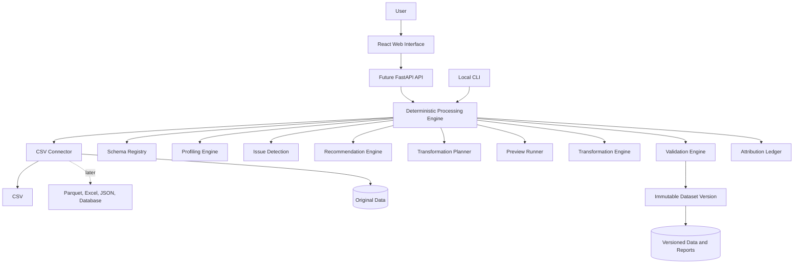

# ClearSet Architecture

## Architectural style

ClearSet starts as a plain Python script and deterministic engine. After the workflow is proven on real data, it can be wrapped in a modular monolith. This keeps infrastructure proportional to evidence and preserves boundaries for a later API or hosted service.

## Detailed component flow

### Visible architecture flow

```text
User
	-> Local script or CLI
	  -> Direct deterministic execution
				  -> Connector manager
				  -> Schema registry
				  -> Profiling engine
				  -> Issue detection
				  -> Recommendation engine
				  -> Transformation planner
				  -> Safe preview
				  -> Transformation engine
				  -> Validation engine
					  -> Immutable dataset version
						  -> Attribution ledger and export bundle
```

The Mermaid version below provides the rendered visual form of the same architecture.



The system has two logical planes:

### Control plane (later API)

Responsible for coordination and metadata:

- API requests
- Dataset catalog
- Users and permissions
- Job records
- Transformation plans
- Dataset versions
- Audit events
- Reports and status

### Data plane (Phase 0)

Responsible for reading and processing data:

- Format connectors
- Sampling
- Profiling
- Issue detection
- Recommendations
- Transformations
- Output validation
- Report generation

## Component responsibilities

### Web interface (later)

Provides dataset upload, profiling views, recommendations, previews, version history, reports, and exports. It should never implement cleaning logic itself.

### API (later)

Validates requests, authorizes access, creates jobs, returns status, and exposes metadata. Large processing must run in workers rather than blocking API requests.

### Connector manager

Presents a common interface for CSV, Excel, JSON, Parquet, databases, and object storage. Profilers and transformers should consume a standard dataset abstraction rather than format-specific code.

### Profiling engine

Calculates row and column counts, inferred types, missingness, uniqueness, distributions, date ranges, constants, duplicates, and possible identifiers.

### Issue detection engine

Finds problems but does not change data. Issues have a type, severity, affected columns, affected rows, evidence, and confidence.

### Recommendation engine

Converts issues into possible actions with explanations, risk levels, expected effects, and reversibility information.

### Transformation engine

Executes approved structured operations. It should produce deterministic output and record the affected rows and columns.

### Validation engine

Runs schema, integrity, and quality checks before and after transformations. A failed output is discarded rather than published as a new valid version.

### Versioning and storage

Original data and every generated version are immutable files. Metadata stores the parent version, operations, hashes, statistics, and validation results.

## Processing contract

The Phase 0 engine receives a dataset location, parent version, transformation plan, and configuration. It returns output metadata, validation results, and attribution events. A worker contract can be introduced later if file size or concurrency creates a measured bottleneck.

The API should never depend on a particular dataframe library. The processing boundary should expose operations such as `inspect`, `sample`, `profile`, `validate`, `transform`, and `export`. Polars, DuckDB, SQL pushdown, or a distributed engine can implement these operations later.

## Reliability boundaries

- Uploads are checked for size, type, encoding, and safe paths before parsing.
- Original files and published versions are immutable.
- Jobs have queued, running, completed, failed, and cancelled states.
- Retries are idempotent and cannot silently create duplicate versions.
- Temporary outputs are cleaned up after success or failure.
- Failed validation prevents a result from becoming a published version.
- Structured logs, metrics, health checks, backups, and migrations are required before hosted deployment.

## Technology direction

Initial local stack:

- FastAPI
- Polars
- DuckDB
- Pandera
- SQLite
- Local file storage

Growth path:

- SQLite to PostgreSQL
- Local files to S3 or MinIO
- In-process jobs to Redis-backed workers
- One worker to multiple workers
- Polars-only processing to Polars, DuckDB, and SQL pushdown