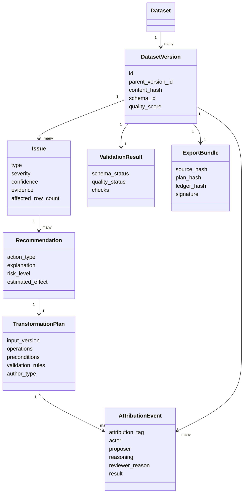

# ClearSet Data Model

## Dataset

Represents a logical dataset across all of its versions.

```text
Dataset
  id
  name
  description
  source_type
  created_at
  owner_id
  current_version_id
```

## Dataset version

Represents an immutable file produced from a parent version.

```text
DatasetVersion
  id
  dataset_id
  parent_version_id
  storage_uri
  content_hash
  row_count
  column_count
  schema_id
  quality_score
  created_at
```

Versions form a history tree rather than an overwrite chain, so alternative cleaning approaches can be compared.



## Issue

```text
Issue
  id
  version_id
  type
  severity
  confidence
  column_names
  affected_row_count
  evidence
  detector_name
```

## Recommendation

```text
Recommendation
  id
  issue_id
  action_type
  explanation
  risk_level
  reversible
  estimated_effect
```

## Transformation plan

Operations must be structured rather than stored only as arbitrary code.

```json
{
  "input_version": "sha256:...",
  "operations": [
    {
      "type": "rename_column",
      "from": "Customer Name",
      "to": "customer_name"
    },
    {
      "type": "fill_missing",
      "column": "age",
      "strategy": "median"
    }
  ],
  "preconditions": [],
  "expected_effects": [],
  "validation_rules": [],
  "author": "reviewer@example.com",
  "author_type": "human",
  "created_at": "2026-09-18T12:00:00Z"
}
```

Plans are the portable product primitive. The CLI, API, UI, and external-agent path should read and write this format rather than implement separate transformation contracts.

## Attribution event

Records who or what proposed, approved, rejected, or applied an operation, when it happened, which version was used, and what was produced. The attribution tag is required and must be one of:

- `human_edit`
- `deterministic_rule`
- `ai_suggested_human_approved`
- `ai_suggested_human_rejected`
- `ai_suggested_human_deferred`

```text
AttributionEvent
  id
  dataset_id
  version_id
  parent_version_id
  operation_id
  attribution_tag
  actor
  proposer
  model_name_and_version
  reasoning
  evidence
  reviewer_reason
  operation_summary
  timestamp
  result
```

Rejected and deferred suggestions have no output version but remain part of the audit history. This makes the decision process inspectable, not just the final file.

## Lineage

For each output column, store its source column and transformations. For important operations, record affected row identifiers or a reproducible selection rule.