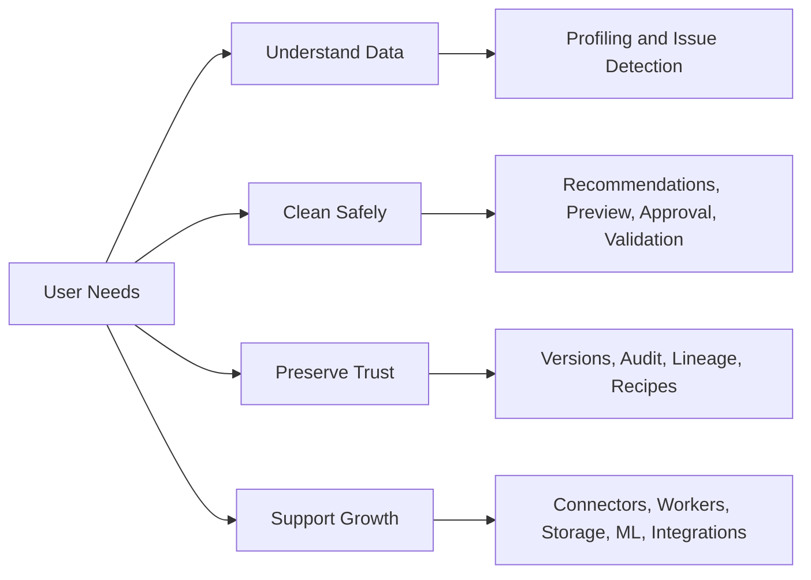

# ClearSet Requirements Traceability

This file cross-checks the capabilities discussed during planning against the documentation and planned implementation.

## Requirements map

### Visible requirements flow

```text
User needs
  -> Understand data
	  -> Profiling and issue detection
  -> Clean safely
	  -> Recommendations, preview, approval, validation
  -> Preserve trust
	  -> Versions, audit log, lineage, reproducible recipes
  -> Support growth
	  -> Connectors, workers, storage, ML checks, integrations
```

The Mermaid version maps the requirement groups to the ClearSet modules that implement them.



| Requirement | Covered in | Initial status |
| --- | --- | --- |
| Automatic profiling | README, ARCHITECTURE, WORKFLOW, QUALITY_CHECKS | Phase 1 |
| Cleaning recommendations with explanations | PRODUCT_BRIEF, WORKFLOW, DIFFERENTIATION | Phase 1 |
| Safe preview before modification | README, WORKFLOW, DECISIONS | Phase 1 |
| Reversible transformations | DATA_MODEL, WORKFLOW, DECISIONS | Phase 1 |
| Audit log | DATA_MODEL, ARCHITECTURE, SCALING | Phase 1 |
| CSV support | README, ROADMAP, ARCHITECTURE | Phase 1 |
| Excel support | ROADMAP, ARCHITECTURE | Phase 2 |
| JSON support | ROADMAP, ARCHITECTURE | Phase 2 |
| Parquet support | README, ROADMAP, ARCHITECTURE | Phase 1 |
| Database connectors | ARCHITECTURE, SCALING, ROADMAP | Phase 5 |
| Dataset versioning | DATA_MODEL, WORKFLOW, SCALING | Phase 1 |
| Label-error checks | QUALITY_CHECKS, ROADMAP | Phase 4 |
| Leakage checks | QUALITY_CHECKS, ROADMAP | Phase 4 |
| Imbalance checks | QUALITY_CHECKS, ROADMAP | Phase 4 |
| Duplicate and near-duplicate checks | QUALITY_CHECKS, ROADMAP | Phase 1 and Phase 4 |
| Non-programmer web interface | PRODUCT_BRIEF, ROADMAP, ARCHITECTURE | Phase 3 |
| Local-first privacy | PRODUCT_BRIEF, DECISIONS, OPEN_QUESTIONS | Phase 1 |
| Explainable quality score | QUALITY_CHECKS, DECISIONS | Phase 1 |
| Schema overrides and custom rules | DATA_MODEL, DECISIONS, OPEN_QUESTIONS | Phase 2 |
| Exportable recipes and reports | README, WORKFLOW, ROADMAP | Phase 1 |
| Scaling to workers and object storage | ARCHITECTURE, SCALING | Phase 5 |
| Security and PII handling | ARCHITECTURE, DECISIONS, OPEN_QUESTIONS | Before hosted deployment |

## Coverage result

The previously discussed product capabilities, architecture, workflow, differentiation, scaling direction, and planning questions are now represented in separate files. Items marked Phase 2 or later are intentionally documented but are not part of the first implementation boundary.