# ClearSet Detailed Workflow

## End-to-end lifecycle

```mermaid
flowchart LR
    Upload[Upload or select dataset] --> Security[Check file and access]
    Security --> Register[Register dataset]
    Register --> Format[Detect format]
    Format --> Schema[Infer or load schema]
    Schema --> Profile[Generate profile]
    Profile --> Issues[Detect issues]
    Issues --> Recommendations[Generate recommendations]
    Recommendations --> Selection[User selects actions]
    Selection --> Plan[Create transformation plan]
    Plan --> Preview[Run safe preview]
    Preview --> PreviewValidation[Validate preview]
    PreviewValidation --> Decision{User approves?}
    Decision -->|No| Selection
    Decision -->|Yes| Apply[Apply transformations]
    Apply --> OutputValidation[Validate output]
    OutputValidation --> Valid{Output valid?}
    Valid -->|No| Discard[Discard failed output]
    Valid -->|Yes| Version[Create immutable version]
    Version --> Audit[Write lineage and audit event]
    Audit --> Export[Export data, report, and recipe]
```



## Step 1: intake

Before parsing a file, ClearSet checks the actual file type, size, encoding, path safety, and access permission. The original is stored without modification and receives a dataset ID and content hash.

## Step 2: schema

The system infers column names and types, but users can override them. A schema may define type, nullability, uniqueness, allowed ranges, categories, and patterns.

## Step 3: profiling

The profiler creates a standard profile containing dataset-level and column-level statistics. Profiles are stored so the same dataset version does not need to be analyzed repeatedly.

## Step 4: issue detection

Detectors report evidence, not guesses. An issue records its type, severity, confidence, affected rows, affected columns, and detection rule.

## Step 5: recommendations

Recommendations are alternatives. For example, missing values may be filled, removed, left unchanged, or marked. Each option includes an explanation and risk level.

## Step 6: preview

The selected plan runs against a sample or temporary copy. The UI shows changed values, affected row counts, before-and-after statistics, and quality-score changes.

## Step 7: approval and application

Only approved operations run against the selected parent version. The original and parent versions remain unchanged.

## Step 8: validation and publication

The result is checked against the schema and quality rules. A valid output becomes a new version; an invalid output is discarded and its failure is recorded.

## Step 9: export

The user can download the dataset, quality report, audit history, and structured cleaning recipe. Python or SQL can be generated from the recipe where supported.

## First-screen experience

After analysis completes, the first screen shows the dataset name, row and column counts, quality-score components, highest-severity issues, missingness summary, duplicate count, and actions to inspect issues or start a preview.

## Change inspection

The preview table highlights changed cells, filters to affected rows, and identifies the operation responsible for each change. Version comparison includes schema, row and column counts, quality components, changed columns, affected rows, and representative samples.

## Recipe reuse

Recipes are saved per project and can be applied to compatible future datasets. If the schema does not match, ClearSet stops and reports the mismatch instead of applying a partial recipe.

## Job states

```text
queued -> running -> completed
                  -> failed
                  -> cancelled
```

Each job needs progress, timestamps, retry count, error details, and cleanup of temporary files.